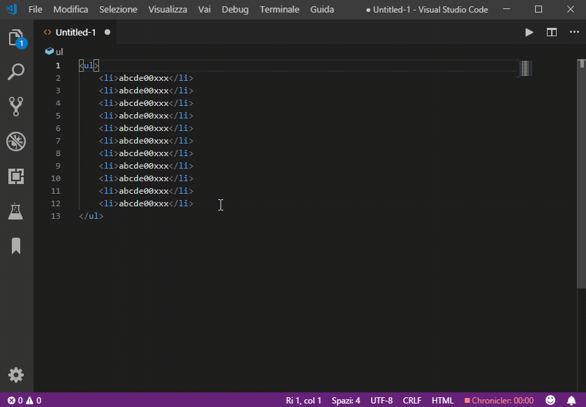

# vscode-progressive-increment

VSCode extension

[](https://github.com/narsenico/vscode-progressive-increment/blob/master/LICENSE)

Increments progressively integer values found in selection(s) by 1 or 10.



## Commands:
- Progressive: increment by 1
- Progressive: increment by 10

## Settings:
- ```progressive.skipFirstNumber```:
if true the first number will not be changed (default **false**).

## Shortcuts:

### Win\Linux:
- Increment by 1:  <kbd>ctrl</kbd> + <kbd>alt</kbd> + <kbd>i</kbd>
- Increment by 10: <kbd>ctrl</kbd> + <kbd>alt</kbd> + <kbd>shift</kbd> + <kbd>i</kbd>

### Mac:
- Increment by 1:  <kbd>cmd</kbd> + <kbd>alt</kbd> + <kbd>i</kbd>
- Increment by 10: <kbd>cmd</kbd> + <kbd>alt</kbd> + <kbd>shift</kbd> + <kbd>i</kbd>
